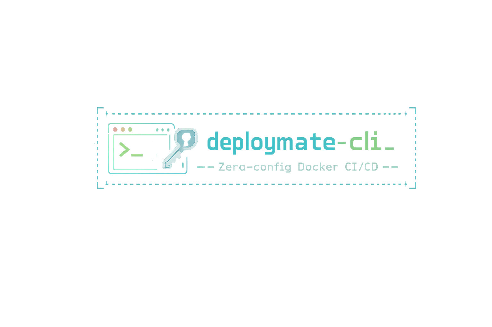

<p align="center">
  
</p>

<p align="center">
  <a href="https://www.npmjs.com/package/deploymate-cli"></a>
  <a href="https://www.npmjs.com/package/deploymate-cli"></a>
  <a href="https://github.com/Benyaminrmb/deploymate/blob/main/LICENSE"></a>
  
</p>

<p align="center">
  <strong>Zero-config Docker CI/CD — SSH key setup + GitHub Actions in one command.</strong><br/>
  No YAML. No manual secrets. No SSH key management. Just fill 5 fields and every push auto-deploys.
</p>

```
npx deploymate-cli
```

---

## How it works

```
┌─────────────────────────────────────────────────────────┐
│                    deploymate  v1.x.x                   │
├─────────────────────────────────────────────────────────┤
│                                                         │
│  ◇  SSH host      →  1.2.3.4                            │
│  ◇  SSH port      →  22                                 │
│  ◇  Username      →  root                               │
│  ◆  Auth          →  ● Password  ○ SSH key file         │
│  ◇  Password      →  ••••••••••                         │
│  ◇  GitHub token  →  ghp_••••••••••••••••               │
│  ◆  Repository    →  ● Use existing  ● Create new       │
│  ◇  Deploy path   →  /opt/my-app                        │
│                                                         │
├─────────────────────────────────────────────────────────┤
│  Summary                                                │
│  Server   1.2.3.4:22 (root)                             │
│  Repo     github.com/you/my-app                         │
│  Path     /opt/my-app                                   │
├─────────────────────────────────────────────────────────┤
│  ◇  Proceed?  Yes                                       │
│                                                         │
│  ✓  Pushing project to GitHub                           │
│  ✓  Generating RSA key pair                             │
│  ✓  Uploading public key to server                      │
│  ✓  Injecting GitHub secrets                            │
│  ✓  Committing deploy.yml                               │
│                                                         │
│  └─ ✓ All done! CI/CD is live.                          │
│     Actions → https://github.com/you/my-app/actions     │
└─────────────────────────────────────────────────────────┘
```

---

## What it automates

```
  Before deploymate              After deploymate
  ──────────────────             ──────────────────────────
  1. Generate SSH keypair   →    ✓  Done in memory
  2. Copy pubkey to server  →    ✓  Uploaded via SSH
  3. Add 4 GitHub secrets   →    ✓  Injected via API
  4. Write deploy.yml       →    ✓  Committed to repo
  5. Push & debug           →    ✓  Live on first push
```

Every push to `main` runs:

```
git fetch + reset --hard origin/main
docker compose down
docker compose up -d --build
```

---

## Requirements

```
  Local        Node.js 18+
  Server       SSH access · Docker · Docker Compose
  GitHub       Personal access token (repo + secrets scopes)
```

---

## Install

```bash
# Run directly (recommended)
npx deploymate-cli

# Or install globally
npm install -g deploymate-cli && deploymate
```

---

## Security model

```
  ┌──────────────────────────────────────────────────────┐
  │  Password     used once to bootstrap key auth        │
  │               never stored, logged, or re-sent       │
  │                                                      │
  │  Private key  lives in memory only                   │
  │               goes straight into GitHub secret       │
  │                                                      │
  │  Secrets      encrypted with libsodium box seal      │
  │               as required by the GitHub API          │
  │                                                      │
  │  After setup  key-based SSH only, no passwords       │
  └──────────────────────────────────────────────────────┘
```

---

## Roadmap

```
  [ ]  Multi-server  (staging + production)
  [ ]  Non-Docker projects  (npm run build / raw git pull)
  [ ]  Rollback to previous commit
  [ ]  Server health check  (CPU · RAM · containers)
  [ ]  GitLab / Bitbucket support
  [ ]  Teardown command  (remove secrets + workflow)
```

PRs welcome — see [CONTRIBUTING](#contributing).

---

## Contributing

```bash
git clone https://github.com/Benyaminrmb/deploymate
cd deploymate && npm install && npm run dev
```

---

## License

MIT © [Benyamin Rmb](https://benyaminrmb.ir)

---

<p align="center">
  Made with ❤️ by <a href="https://benyaminrmb.ir">Benyamin Rmb</a>
  &nbsp;·&nbsp;
  <a href="https://reymit.ir/benyaminrmb">☕ Buy me a coffee</a>
  &nbsp;·&nbsp;
  <a href="https://www.npmjs.com/package/deploymate-cli">npm</a>
</p>
